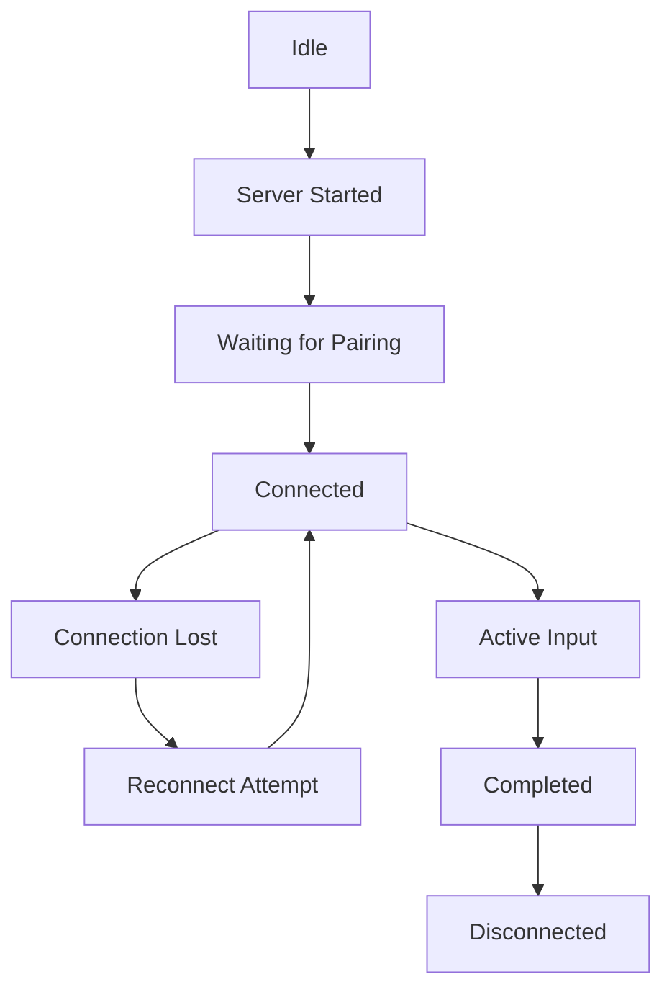

# 📝 Product Requirements Document (PRD): LANpad

**Status:** Final / Engineering Ready  
**Author:** Nithin  
**Version:** 1.4.1 (Final Engineering Handoff)

---

## 1. Product Vision
LANpad turns a smartphone into a low-latency **intelligent input companion** for laptops and desktops, enabling instant local text transfer, human-like typing simulation, and real-time synchronization without relying on cloud services.

## 2. Problem Statement
Users frequently need to move text (links, credentials, code snippets, or notes) from their mobile devices to their laptops. Existing solutions (cloud notes, messaging themselves) are slow, require internet access, and are often blocked by corporate firewalls or restricted environments where clipboard pasting is disabled.

## 3. Goals & Objectives
*   **Near-Real-Time Execution:** End-to-end synchronization latency target below 50ms.
*   **Restricted Environment Support:** Human-like typing simulation for environments where direct clipboard pasting is unavailable or restricted.
*   **Privacy First:** Ensure all data remains on the local Wi-Fi network with temporary in-memory handling only.
*   **Seamless Onboarding:** One-click server start and QR-based mobile connection.

## 4. Target Audience
*   **Developers:** Moving code snippets from mobile documentation to IDEs.
*   **Students:** Quick notes transfer from phone to assignment docs.
*   **Privacy-Focused Users:** Transferring sensitive text snippets or temporary credentials with local-only memory residency.

## 5. System Architecture & Request Flow

### Components:
*   **FastAPI Backend (Host)**: Core logic server and QR generation.
*   **Keyboard Simulation Engine**: Platform-native event injection (e.g., macOS Quartz Events / Windows SendInput).
*   **Mobile Browser UI**: Cross-platform WebSocket-enabled controller.

### Request Flow:
1.  **Launch**: User starts LANpad server on Laptop.
2.  **Discovery**: Backend generates session token + QR code based on local IP.
3.  **Pairing**: Mobile scans QR and establishes WebSocket/HTTP connection.
4.  **Submission**: User submits text from mobile controller.
5.  **Injection**: Keyboard engine executes native events on the active host window.
6.  **Feedback**: Execution confirmation and status pushed via WebSocket.

## 6. Functional Requirements

### FR-01: Local Backend Server
*   The system must run a FastAPI server locally on the host machine.
*   The server must be startable via a custom macOS protocol (`lanpad://`) from a browser extension.

### FR-02: Input Modes
*   **Flash**: Immediate high-speed text transfer using clipboard injection. Automatically falls back to **Type Mode** if pasting is restricted.
*   **Type**: Human-like keyboard event simulation for bypassing paste blocks.
*   **Inject**: Cleaned text injection with auto-formatting/indentation clearing for code.
*   **Live Sync**: Real-time character synchronization between mobile input and host cursor.

### FR-03: API Contract (Core Endpoints)

| Endpoint | Method | Purpose |
| :--- | :--- | :--- |
| `/session/create` | POST | Generate session token and pairing QR |
| `/ws/connect` | WebSocket | Establish live bi-directional sync |
| `/input/send` | POST | Send text payload and mode parameters |
| `/clipboard/get` | GET | Retrieve host clipboard for mobile pull |
| `/server/terminate` | POST | Securely shutdown (requires token) |

### FR-04: Payload Structure (Sample JSON)
```json
{
   "session_id": "abc123",
   "mode": "type",
   "content": "Hello World",
   "wpm": 80,
   "timestamp": "2026-05-14T20:15:00Z"
}
```

### FR-05: Session State Model


## 7. Platform & Connection Requirements

### Platform Permissions:
*   **macOS**: Accessibility permissions (for keyboard simulation) and Clipboard access.
*   **Windows**: Keyboard hook permissions and Clipboard access.

### Connection Constraints (MVP):
*   **1:1 Ratio**: One active host machine to one active mobile controller.
*   **Local Only**: Both devices must be on the same sub-network.

## 8. Security & Data Handling
*   **No Long-Term Persistence**: Data exists only in temporary memory (RAM) during active sessions and is removed after transfer completion.
*   **Session Security**: Device pairing via QR code containing temporary, non-reusable session tokens.
*   **Automatic Termination**: Session terminates after 15 minutes of inactivity or immediately upon manual disconnect.

## 9. Diagnostics & Observability
*   **Local Logging**: Connection events and session errors logged locally on the host machine.
*   **24-Hour Retention**: Logs are retained temporarily for debugging and then automatically deleted.
*   **Debug Mode**: Optional detailed tracing for development and troubleshooting.

## 10. Risks & Assumptions

### Risks:
*   **OS Restrictions**: Future OS updates may further restrict keyboard event injection.
*   **Browser Security**: Changes to mobile browser WebSocket handling may affect sync quality.
*   **Network Jitter**: Local Wi-Fi instability may increase perceived latency.

### Assumptions:
*   User devices share the same local sub-network.
*   Host system grants necessary Accessibility/Input permissions.

## 11. Competitive Advantage

| Feature | LANpad | KDE Connect | Pushbullet | Phone Link |
| :--- | :---: | :---: | :---: | :---: |
| **Internet Needed** | **No** | No | Yes | Partial |
| **Human-like Typing Support**| **Yes** | No | No | No |
| **Live Sync Typing** | **Yes** | Partial | No | No |
| **Local Only** | **Yes** | Yes | No | Partial |

## 12. MVP vs Future Scope

### Phase 1 (In-Scope):
*   Local FastAPI server & Standalone Binary.
*   QR-pairing & Type simulation.
*   Basic Live Sync & Clipboard Pull.

### Out of Scope (Phase 1):
*   Internet-based/Remote synchronization.
*   Cloud storage or history persistence.
*   **Input Orchestration**: Remote macros, IDE controls, or voice-to-action triggers (Planned for Phase 2).

## 13. Success Metrics

| Metric | Target |
| :--- | :--- |
| **First-time setup** | < 2 min |
| **End-to-end Response** | < 50 ms |
| **Successful transfer rate** | ≥ 95% |
| **Average transfer completion** | < 3 sec |
| **User retention (Week 1)** | ≥ 60% |

---
*End of PRD*
